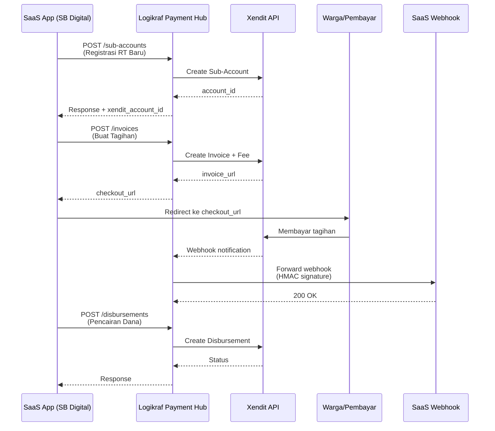

# Logikraf Payment Hub Documentation

Dokumentasi teknis untuk integrasi **Logikraf Payment Hub** menggunakan Xendit xenPlatform. Dokumen ini ditujukan untuk tim pengembang SaaS (seperti SB Digital atau aplikasi lainnya) yang ingin menghubungkan sistem tagihan ke Payment Hub Logikraf.

---

## 1. Overview

### 1.1 Apa itu Logikraf Payment Hub?

Logikraf Payment Hub adalah solusi pembayaran terpusat berbasis REST API yang memungkinkan aplikasi SaaS untuk:

- **Membuat Sub-Account** otomatis untuk setiap entitas komunitas (RT/RW, toko, organisasi, dll)
- **Menerbitkan Invoice** dengan fee platform yang otomatis dipotong
- **Mengelola Disbursement** untuk pencairan dana ke rekening bank
- **Menerima Webhook** notifikasi pembayaran secara real-time

### 1.2 Arsitektur xenPlatform

```
┌─────────────────────────────────────────────────────────────┐
│                    LOGIKRAF MASTER ACCOUNT                   │
│                    (Akun Xendit Utama)                      │
│                                                              │
│  ┌─────────────┐    ┌─────────────┐    ┌─────────────┐     │
│  │ Platform Fee│    │ Platform Fee│    │ Platform Fee│     │
│  │   (Otomatis)│    │   (Otomatis)│    │   (Otomatis)│     │
│  └─────────────┘    └─────────────┘    └─────────────┘     │
└─────────────────┬─────────┬─────────┬───────────────────────┘
                  │         │         │
                  ▼         ▼         ▼
┌─────────────────┐┌─────────────────┐┌─────────────────┐
│   SUB-ACCOUNT   ││   SUB-ACCOUNT   ││   SUB-ACCOUNT   │
│  RT 01 Perum   ││  RT 02 Perum   ││  Toko ABC       │
│   (Dana Warga)  ││   (Dana Warga)  ││   (Dana Penjual)  │
└─────────────────┘└─────────────────┘└─────────────────┘
```

---

## 2. Persiapan Integrasi

### 2.1 Persyaratan Awal

Sebelum mulai mengintegrasikan, pastikan Anda telah mendapatkan:

| Item                 | Keterangan                                                                        |
| -------------------- | --------------------------------------------------------------------------------- |
| **API Key Logikraf** | Format `sk_test_xxxxxx` - didapatkan dari Admin Logikraf saat registrasi aplikasi |
| **Webhook URL**      | URL endpoint di server SaaS Anda yang bisa menerima POST request                  |

### 2.2 Environment Variables (Opsional)

Jika menggunakan Laravel, tambahkan di `.env`:

```env
# Payment Hub Configuration
LOGIKRAF_API_KEY=logikraf_test_xxxxxxxxxxxxxxxxxxxxxxxx
LOGIKRAF_WEBHOOK_URL=https://app.yourdomain.com/webhooks/logikraf-payment
```

---

## 3. API Endpoints

### Base URL

```
https://logikraf.id/api/payment-hub/v1
```

### Authentication Header

Semua request ke Payment Hub wajib menyertakan header berikut:

```http
Content-Type: application/json
Accept: application/json
X-Logikraf-API-Key: logikraf_test_xxxxxxxxxxxxxxxxxxxxxxxx
```

### 3.1 Membuat Sub-Account

**Endpoint:** `POST /sub-accounts`

Membuat Sub-Account di Xendit untuk entitas Anda (misal: RT, RW, atau toko). Dana yang masuk akan otomatis terpisah di rekening ini.

#### Request Body

```json
{
    "external_reference_id": "RT01-PERUM-MAWAR",
    "business_name": "Kas RT 01 Perum Mawar",
    "email": "pengurus.rt01@example.com"
}
```

#### Parameters

| Parameter               | Tipe   | Required | Keterangan                               |
| ----------------------- | ------ | -------- | ---------------------------------------- |
| `external_reference_id` | string | Ya       | ID unik entitas di database SaaS Anda    |
| `business_name`         | string | Ya       | Nama yang akan muncul di rekening Xendit |
| `email`                 | string | Ya       | Email untuk notifikasi Xendit            |

#### Response Success (201)

```json
{
    "message": "Sub-Account created successfully",
    "data": {
        "id": 1,
        "saas_application_id": 1,
        "external_reference_id": "RT01-PERUM-MAWAR",
        "xendit_account_id": "acc_xxx",
        "business_name": "Kas RT 01 Perum Mawar",
        "status": "active",
        "created_at": "2026-07-12 10:30:00"
    }
}
```

#### Response Error (200 - Already Exists)

```json
{
    "message": "Sub-account already exists",
    "data": {
        "id": 1,
        "external_reference_id": "RT01-PERUM-MAWAR",
        ...
    }
}
```

---

### 3.2 Membuat Invoice (Tagihan)

**Endpoint:** `POST /invoices`

Membuat tagihan untuk pembayaran warga. Sistem akan otomatis menambahkan Platform Fee berdasarkan konfigurasi aplikasi Anda.

#### Request Body

```json
{
    "external_id": "INV-WARGA-001",
    "external_reference_id": "RT01-PERUM-MAWAR",
    "amount": 50000,
    "payer_email": "warga.a@gmail.com",
    "description": "Iuran Kebersihan Bulan Juli 2026"
}
```

#### Parameters

| Parameter               | Tipe    | Required | Keterangan                                          |
| ----------------------- | ------- | -------- | --------------------------------------------------- |
| `external_id`           | string  | Ya       | ID unik tagihan di database SaaS Anda               |
| `external_reference_id` | string  | Ya       | ID Sub-Account tujuan (sama dengan saat registrasi) |
| `amount`                | integer | Ya       | Nominal dasar tagihan (min: 1,000)                  |
| `payer_email`           | string  | Ya       | Email pembayar                                      |
| `description`           | string  | Ya       | Deskripsi/tagihan                                   |

#### Response Success (201)

```json
{
    "message": "Invoice created successfully",
    "data": {
        "transaction": {
            "id": 123,
            "external_id": "INV-WARGA-001",
            "amount": "50000.00",
            "platform_fee_amount": "2500.00",
            "status": "PENDING",
            "created_at": "2026-07-12 10:35:00"
        },
        "checkout_url": "https://checkout.xendit.co/xxx"
    }
}
```

> **Catatan:** Anda cukup mengirimkan nominal dasar (`amount`). Platform Fee akan dihitung otomatis oleh sistem berdasarkan konfigurasi di Admin Portal.

---

### 3.3 Cek Status Invoice

**Endpoint:** `GET /invoices/{external_id}`

Mengecek status invoice yang sudah dibuat.

#### Response Success (200)

```json
{
    "message": "Success",
    "data": {
        "id": 123,
        "external_id": "INV-WARGA-001",
        "xendit_invoice_id": "inv_xxx",
        "invoice_url": "https://checkout.xendit.co/xxx",
        "amount": "50000.00",
        "platform_fee_amount": "2500.00",
        "status": "PAID",
        "paid_at": "2026-07-12 11:00:00"
    }
}
```

---

### 3.4 Pencairan Dana (Disbursement)

**Endpoint:** `POST /disbursements`

Mencairkan dana dari Sub-Account ke rekening bank.

#### Request Body

```json
{
    "external_id": "PENC-001",
    "external_reference_id": "RT01-PERUM-MAWAR",
    "amount": 1500000,
    "bank_code": "BCA",
    "account_holder_name": "Bapak Budi Ketua RT",
    "account_number": "1234567890",
    "description": "Pencairan Kas Bulan Juli"
}
```

#### Parameters

| Parameter               | Tipe    | Required | Keterangan                              |
| ----------------------- | ------- | -------- | --------------------------------------- |
| `external_id`           | string  | Ya       | ID unik pencairan di database SaaS Anda |
| `external_reference_id` | string  | Ya       | ID Sub-Account sumber dana              |
| `amount`                | integer | Ya       | Nominal pencairan (min: 10,000)         |
| `bank_code`             | string  | Ya       | Kode bank: BCA, MANDIRI, BNI, BRI, DLL  |
| `account_holder_name`   | string  | Ya       | Nama pemilik rekening                   |
| `account_number`        | string  | Ya       | Nomor rekening                          |
| `description`           | string  | Tidak    | Keterangan pencairan                    |

#### Response Success (201)

```json
{
    "message": "Disbursement created successfully",
    "data": {
        "id": 456,
        "external_id": "PENC-001",
        "amount": "1500000.00",
        "bank_code": "BCA",
        "status": "COMPLETED",
        "created_at": "2026-07-12 14:00:00"
    }
}
```

---

## 4. Webhook Integration

### 4.1 Webhook URL Configuration

Webhook URL di-set melalui Admin Portal Logikraf di menu **Aplikasi Terintegrasi**. Setiap aplikasi SaaS harus mendaftarkan endpoint yang bisa menerima POST request.

### 4.2 Format Webhook Payload

Ketika pembayaran berhasil, Logikraf akan mengirim POST ke webhook Anda dengan payload:

```json
{
    "external_id": "PHUB-1-INV-WARGA-001",
    "status": "PAID",
    "paid_amount": 52500,
    "payment_method": "BCA_VA",
    "created": "2026-07-12T10:35:00.000Z"
}
```

> **Format ID:** `PHUB-{SAAS_APP_ID}-{EXTERNAL_ID_ANDA}`

### 4.3 Signature Verification

Untuk keamanan, setiap webhook mengandung signature HMAC SHA-256.

#### Header Webhook

```http
X-Logikraf-Signature: sha256_signature
Content-Type: application/json
```

#### Verifikasi di Laravel/PHP

```php
use Illuminate\Http\Request;

public function handleLogikrafWebhook(Request $request)
{
    // Ambil signature dari header
    $signature = $request->header('X-Logikraf-Signature');
    $apiKey = env('LOGIKRAF_API_KEY');

    // Hitung signature yang diharapkan
    $expectedSignature = hash_hmac('sha256', $request->getContent(), $apiKey);

    // Validasi signature
    if (!hash_equals($expectedSignature, $signature)) {
        Log::warning('Invalid webhook signature from Logikraf');
        return response()->json(['message' => 'Invalid signature'], 403);
    }

    $payload = $request->all();

    // Parse external_id untuk mendapatkan ID asli
    $parts = explode('-', $payload['external_id'], 3);
    $myInvoiceId = $parts[2] ?? null;

    // Update status di database
    if ($payload['status'] === 'PAID') {
        Invoice::where('invoice_code', $myInvoiceId)
            ->update([
                'status' => 'lunas',
                'paid_at' => now(),
                'payment_method' => $payload['payment_method']
            ]);
    }

    return response()->json(['status' => 'ok']);
}
```

### 4.4 Status Transaksi

| Status    | Keterangan                           |
| --------- | ------------------------------------ |
| `PENDING` | Tagihan belum dibayar                |
| `PAID`    | Tagihan sudah dibayar                |
| `SETTLED` | Tagihan completed (sama dengan PAID) |
| `EXPIRED` | Tagihan expired/kadaluarsa           |
| `FAILED`  | Pembayaran gagal                     |

---

## 5. Dynamic Platform Fee

### 5.1 Konfigurasi Fee

Admin Logikraf dapat mengatur fee di Admin Portal:

| Tipe Fee     | Keterangan                          |
| ------------ | ----------------------------------- |
| `fixed`      | Fee nominal tetap (misal: Rp 2,500) |
| `percentage` | Fee persentase (misal: 1%)          |

### 5.2 Contoh Perhitungan

Misal: Tagihan iuran warga Rp 50,000

**Jika fee = fixed Rp 2,500:**

- Total yang dibayar warga: Rp 52,500
- Dana masuk ke Sub-Account: Rp 50,000
- Fee ke Logikraf: Rp 2,500

**Jika fee = percentage 5%:**

- Fee yang dihitung: Rp 2,500 (50,000 × 5%)
- Total yang dibayar warga: Rp 52,500
- Dana masuk ke Sub-Account: Rp 50,000
- Fee ke Logikraf: Rp 2,500

### 5.3 Implementasi di InvoiceController

Fee dihitung otomatis oleh sistem:

```php
// Jika platform_fee_type = 'fixed'
$platformFeeAmount = $saasApp->platform_fee_amount;

// Jika platform_fee_type = 'percentage'
$platformFeeAmount = $request->amount * ($saasApp->platform_fee_amount / 100);

$totalAmount = $request->amount + $platformFeeAmount;
```

---

## 6. Database Schema

### 6.1 saas_applications

Tabel untuk mendaftarkan aplikasi SaaS yang terintegrasi.

```sql
Schema::create('saas_applications', function (Blueprint $table) {
    $table->id();
    $table->string('name');                    -- Nama aplikasi
    $table->string('api_key')->unique();       -- API Key unik
    $table->string('webhook_url')->nullable(); -- URL webhook callback
    $table->string('platform_fee_type')->default('fixed'); -- fixed/percentage
    $table->string('platform_fee_amount')->default('2500'); -- Nominal fee
    $table->boolean('is_active')->default(true);
    $table->timestamps();
});
```

### 6.2 ph_sub_accounts

Sub-Account untuk setiap entitas komunitas/toko.

```sql
Schema::create('ph_sub_accounts', function (Blueprint $table) {
    $table->id();
    $table->foreignId('saas_application_id')->constrained();
    $table->string('external_reference_id');    -- ID entitas di SaaS
    $table->string('xendit_account_id');      -- ID akun Xendit
    $table->string('business_name');          -- Nama bisnis
    $table->string('status')->default('active');
    $table->timestamps();
});
```

### 6.3 ph_transactions

Transaksi pembayaran Payment Hub.

```sql
Schema::create('ph_transactions', function (Blueprint $table) {
    $table->id();
    $table->foreignId('saas_application_id')->constrained();
    $table->foreignId('ph_sub_account_id')->nullable()->constrained();
    $table->string('external_id');            -- ID tagihan di SaaS
    $table->string('xendit_invoice_id')->nullable();
    $table->string('invoice_url')->nullable();
    $table->decimal('amount', 15, 2);         -- Nominal dasar
    $table->decimal('platform_fee_amount', 15, 2)->default(0);
    $table->string('status')->default('PENDING');
    $table->string('payment_method')->nullable();
    $table->timestamp('paid_at')->nullable();
    $table->boolean('forwarded_to_webhook')->default(false);
    $table->timestamps();

    $table->unique(['saas_application_id', 'external_id']);
});
```

### 6.4 ph_disbursements

Riwayat pencairan dana.

```sql
Schema::create('ph_disbursements', function (Blueprint $table) {
    $table->id();
    $table->foreignId('saas_application_id')->constrained();
    $table->foreignId('ph_sub_account_id')->constrained();
    $table->string('external_id')->unique();
    $table->string('xendit_disbursement_id')->nullable();
    $table->decimal('amount', 15, 2);
    $table->string('bank_code');
    $table->string('account_holder_name');
    $table->string('account_number');
    $table->string('status');                 -- PENDING/COMPLETED/FAILED
    $table->string('description')->nullable();
    $table->timestamps();
});
```

---

## 7. Error Handling

### 7.1 HTTP Status Codes

| Code | Keterangan                           |
| ---- | ------------------------------------ |
| 200  | Success / Already exists             |
| 201  | Created                              |
| 401  | API Key missing atau invalid         |
| 404  | Sub-account tidak ditemukan          |
| 422  | Validasi error atau Xendit API error |

### 7.2 Error Response Format

```json
{
    "message": "Sub-account not found",
    "xendit_error": {
        "message": "Account not found",
        "errors": [...]
    }
}
```

---

## 8. Contoh Implementasi

### 8.1 cURL - Membuat Sub-Account

```bash
curl -X POST https://logikraf.id/api/payment-hub/v1/sub-accounts \
  -H "Content-Type: application/json" \
  -H "Accept: application/json" \
  -H "X-Logikraf-API-Key: logikraf_test_xxxxxxxxxxxxxxxxxxxxxxxx" \
  -d '{
    "external_reference_id": "RT01-PERUM-MAWAR",
    "business_name": "Kas RT 01 Perum Mawar",
    "email": "pengurus.rt01@example.com"
  }'
```

### 8.2 PHP - Membuat Invoice

```php
use Illuminate\Support\Facades\Http;

$apiKey = env('LOGIKRAF_API_KEY');

$response = Http::withHeaders([
    'Content-Type' => 'application/json',
    'Accept' => 'application/json',
    'X-Logikraf-API-Key' => $apiKey
])->post('https://logikraf.id/api/payment-hub/v1/invoices', [
    'external_id' => 'INV-WARGA-001',
    'external_reference_id' => 'RT01-PERUM-MAWAR',
    'amount' => 50000,
    'payer_email' => 'warga.a@gmail.com',
    'description' => 'Iuran Kebersihan Bulan Juli 2026'
]);

if ($response->successful()) {
    $checkoutUrl = $response->json('data.checkout_url');
    // Redirect user ke checkout
    return redirect($checkoutUrl);
}
```

### 8.3 JavaScript (Fetch API) - Membuat Disbursement

```javascript
const apiKey = "logikraf_test_xxxxxxxxxxxxxxxxxxxxxxxx";

fetch("https://logikraf.id/api/payment-hub/v1/disbursements", {
    method: "POST",
    headers: {
        "Content-Type": "application/json",
        Accept: "application/json",
        "X-Logikraf-API-Key": apiKey,
    },
    body: JSON.stringify({
        external_id: "PENC-001",
        external_reference_id: "RT01-PERUM-MAWAR",
        amount: 1500000,
        bank_code: "BCA",
        account_holder_name: "Bapak Budi Ketua RT",
        account_number: "1234567890",
        description: "Pencairan Kas Bulan Juli",
    }),
})
    .then((response) => response.json())
    .then((data) => console.log(data));
```

---

## 9. Alur Kerja (Flow Diagram)



---

## 10. FAQ (Frequently Asked Questions)

### Q: Apakah saya perlu KYC ke Xendit?

**A:** Tidak. Logikraf sudah menjadi penyedia layanan utama. Semua entitas RT akan membuat Sub-Account di bawah naungan Logikraf.

### Q: Apakah uang warga aman di Sub-Account?

**A:** Ya. Dana warga langsung masuk ke Sub-Account yang terpisah dari rekening Logikraf. Dana bisa dicairkan kapan saja.

### Q: Bagaimana cara mendaftarkan aplikasi SaaS?

**A:** Hubungi Admin Logikraf untuk menambahkan aplikasi di Admin Portal. Sistem akan generate API Key otomatis.

### Q: Platform Fee bisa di-custom per entitas?

**A:** Platform Fee dikonfigurasi per aplikasi SaaS, bukan per entitas. Semua entitas di bawah satu SaaS menggunakan fee yang sama.

---

## 11. Changelog

| Tanggal    | Versi | Perubahan                                                                                                       |
| ---------- | ----- | --------------------------------------------------------------------------------------------------------------- |
| 2026-07-12 | v1.0  | - Rilis awal Payment Hub<br/>- API Sub-Account, Invoice, Disbursement<br/>- Webhook forwarding dengan queue job |
| 2026-07-12 | v1.1  | - Dynamic platform fee (fixed/percentage)<br/>- Admin UI untuk monitoring transaksi                             |

---

## 12. Support

Untuk bantuan teknis atau pertanyaan integrasi:

- **Email:** support@logikraf.id
- **WhatsApp:** +62-xxx-xxx-xxx-xxx
- **Dokumentasi Admin Portal:** Lihat menu "API Docs" di Admin Logikraf

---

> **Catatan Keamanan:** Simpan API Key dengan aman. Jangan pernah menyimpan di client-side atau repository publik. Gunakan environment variables atau secret management system.
